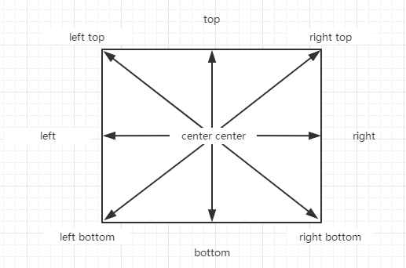

CSS
==

## 概述
```text
Cascading Style Sheets，层叠样式表，
控制网页样式并允许将样式信息与网页内容分离的一种标记性语言。
CSS负责结构、表现、行为中的表现
如设置背景颜色、字体颜色、字体大小等
```

## css注释
块注释
```css
/* 注释内容 */
```

## css代码位置
### 元素内联style属性
只对当前标签起作用，不能对样式进行复用，不方便后期维护，不推荐使用
```html
<p style="color:red; font-size:40px;"></p>
```

### head块内style标签
样式写到head块中的style标签中
进一步将表现和结构分离，可以同时为多个元素设置样式，方便后期的维护
```html
<head>
    <style type="text/css">
        p {
            color:red;
            background-color:yellow;
        }
    </style>
</head>
```

### 引入外部css资源
可以在不同的页面中使用同一个css文件，完全将表现和结构分离，方便后期的维护，推荐使用的方式
* 链接式
    ```html
    <head>
        <link rel="stylesheet" type="text/css" href="css文件的相对路径 或 URL(如//bar.tmall.com/index.css)"/>
    </head>
    ```
* 导入式
```html
<head>
    <style type="text/css">
        @import "./css/style.css"; 
        /* 或
        @import url("//g.alicdn.com/index.css");
         */
    </style>
</head>
```
* 两者区别
```text
区别：使用链接式时，会在装载页面主体部分 之前装载css文件，这样现实出来的页面从一开始就是带有样式效果的，
而使用导入式时，会在整个页面装载完成之后再装载css文件。
```

### css文件中引入其他css资源
```css
/* 导入另一个CSS文件 */
@import "./css/style.css"; 
/* 或
@import url("//g.alicdn.com/index.css");
 */
```

## 基本语法
```css
选择器 {
    /* 样式 */
    key1: value1;
    key2: value2;
}

/* 示例 */
div {
    font-size: 14px;
}
```

## 常用选择器
通过选择器可以选中页面中的一组元素，然后为其设置样式  
可参考 http://jquery.cuishifeng.cn/

* 元素选择器  
    根据标签名，选中页面中的指定元素
    ```css
    标签名 {
        /* 样式 */
    }
    
    /* 示例 */
    div {
        font-size: 14px;
    }
    ```
* id选择器  
    根据元素的id属性值选中一个唯一的元素
    ```css
    #id {}

    #box1 {}
    ```
* 类选择器  
    根据元素的class属性值，选中一组元素
    ```css
    .class {}
    
    .box {}
    ```

* 选中页面中的所有元素  
    性能比较差，尽量避免使用
    ```css
    * {}
    ```
* 并集选择器  
    可以同时选中多个选择器的元素
    ```css
    选择器1, 选择器2, 选择器N {}
    
    div, p, #box, .hello {}
    ```
* 交集选择器  
    可以选中满足多个条件的元素
    ```css
    选择器1 选择器2 选择器N {}
    
    div p.hello {}
    ```
* 层级选择器
    * 后代元素选择器
        ```css
        祖先元素 后代元素 {}
        
        div span {}
        ```
    * 子元素选择器
        选中指定元素的指定子元素
        ```css
        父元素 > 子元素 {}
        
        div > p {}
        ```
    * prev + next
        ```text
        匹配跟在 prev 后为 next 的next这个兄弟元素
        prev与next为同级
        ```
    * prev ~ siblings
        ```text
        查找与prev同辈的兄弟元素中为siblings的元素 （不包括prev）
        prev与siblings为同级
        ```
* 属性选择器
    ```text
    [attribute]
    有属性attribute
    
    [attribute=value]
    attribute值 等于 value
    
    [attribute!=value]
    attribute值 不等于 value
    
    [attribute^=value]
    属性attribute名已value开头
    
    [attribute$=value]
    属性attribute名以value结尾
    
    [attribute*=value]
    属性attribute包含value
    
    [attrSel1][attrSel2][attrSelN]
    多个属性选择器为与关系，同时满足这些选择器
    ```

### css声明块
一个声明就是一个样式，以k:v键值对行使表示
```text
color: red;
font-size: 20px;
```

#### css声明块特殊说明
* 样式名前加*  
    表示只针对IE浏览器生效
    ```css
    .clearfix {
        *zoom: 1;
    }
    ```
* 样式名前加_  
    表示只针对IE 6浏览器生效
    ```css
    .sc .txt{
    	/*设置上外边距*/
    	margin-top: 15px;
    	/*为IE 6设置上外边距*/
    	_margin-top: 18px;
    	margin-bottom: 0px;
    }
    ```
    
## 伪类和伪元素选择器
伪类用来表示元素所处的一个特殊的状态，伪元素用来表示元素所在的位置

伪元素所控制的内容和一个元素控制的内容一样，但是伪元素不存在于文档树中，不是真正的元素，所以叫伪元素 

:符号是伪类，

::符号是伪元素


* :link
    
    >表示一个普通的链接（未访问过的链接）
* :visited
    
    >表示访问过的链接，与link互斥
* :hover
    
    >鼠标移入的链接，也可以为其他元素设置hover
* :active
    >正在被点击的链接，也可以为其他元素设置active

    **[a的伪类示例](../source_03/day03/10.a的伪类.html)**
    
* :focus
    
    >表示元素获取焦点的状态，一般用于文本框
* ::selection
    
    >表示内容被选中的状态，在火狐中使用::-moz-selection来代替
* :first-letter、::first-letter
    
    >表示第一个字符
* :first-line、::first-line
    
    >表示文字的第一行
* :before、::before
    >选中元素的innerHTML的最前边  
    一般该伪类都会结合content一起使用，通过content可以向指定位置添加内容
* :after、::after
    >选中元素的innerHTML的最后边  
    一般该伪类都会结合content一起使用，通过content可以向指定位置添加内容
### 子元素的伪类选择器
* :first-child
* :last-child
* :nth-child(n|even|odd|formula)
    ```text
    n
    匹配子元素序号
    必须为整数，注意从1开始而不是0
    
    even
    匹配所有偶数元素
    
    odd
    匹配所有奇数元素
    
    formula
    使用特殊公式如(an + b)进行选择. 
    例如:nth-of-type(3n+2) 从第二个具此标签元素开始，匹配每个3的倍数的元素
    ```
* :first-of-type
* :last-of-type
* :nth-of-type(n|even|odd|formula)，参数同nth-child

### 否定伪类选择器
* :not(选择器)
    
    >如：.abc:not(div) {}

#### 最后一个元素除外

* 示例：给ul li画格子
```css
.kline-nav ul {
    display: inline-block;
    border: 1px #868B8F solid;
}

.kline-nav ul li:not(:last-child) {
    border-right: 1px #868B8F solid;
}
```

## 选择器的优先级
### 优先级值
* 内联样式：1000
* id选择器：100
* 类和伪类选择器：10
* 元素选择器：1
* *通配符选择器：0
* 继承的样式：没有优先级

### 优先规则
1. html 标签中的 style="" 优先于css文件中的样式，!important 标识的除外
    ```html
    <div style="width: 50px; height:20"></div>
    ````
2. 当样式发生冲突时，需要将相关的选择器优先级进行求和计算，优先级高(值大)的优先显示，如果优先级一样，则显示靠后的样式
3. 优先级计算时，总大小不能超过他的最大的数量级(层级)
4. 可以在样式后边添加一个!important，该样式获取最大的优先级
	```text
	div {
		color: #f00 !important;
	}
	div {
		color: #000;
	}
	如果样式中添加了该内容，则该样式将会获取最大的优先级，
	将会优先于所有的样式显示，包括内联样式，但是这个属性要慎用。
	```

## 选择器的性能
* 浏览器在解析一组选择器时，是从后边往前一个一个的解析的
* 如果选择器编写过于长的话，浏览器解析起来性能会比较差，所以在编写选择器时，越短越好。
* *通配选择器，性能也比较差，要避免使用通配选择器

## 元素之间的关系
* 父元素  
    直接包含当前元素的的元素叫做父元素
* 子元素
    直接被当前元素包含的元素叫做子元素
* 祖先元素  
    直接或间接包含当前元素的元素叫做祖先元素，即父元素和父元素的父元素
* 后代元素  
    直接或间接被当前元素包含的元素叫后代元素，即子元素和子元素的子元素
* 兄弟元素  
    拥有相同父元素的元素叫做兄弟元素

## 样式的继承
* 为祖先元素设置样式，会同时应用到它的后代元素上，这一特性称为样式的继承。
* 通过样式的继承可以将一些样式统一设置给祖先元素，这样所有的后代都会应用到相同的样式。
* 但是并不是所有的样式都会继承，比如：背景相关的，边框相关的，定位相关的。具体参考文档

## 块元素和内联元素特点
### 块元素
```text
block块元素会独占页面中的一行，无论有多少内容
一般使用块元素对页面进行布局

* 常见的块元素:
    div
    p 
    h1~h6 
    table 
    form
```

### 内联元素
```text
内联元素也叫行内元素（inline）

内联元素只占用自身的大小，不会独占一行
一般内联元素都是用来为文本来设置效果

* 常见的内联元素
    span  没有任何的语义，span标签专门用来选中文字
    a
    img
    input
    button
    iframe
```

### 包裹规则
* 一般都是使用块元素去包裹内联元素，而不会使用内联去包裹块元素
* a元素可以包含任意元素，除了a本身
* p元素不能包含任何块元素


## 单位
### 长度单位
* px
    >像素，一个像素指的就是一个像素点，不同的显示器中，一个像素的大小是不同的，越清晰的屏幕像素越小  
    "绝对大小"
* %
    
    >百分比，如20%
* em
    
    >相对于当前对象内文本的font-size值的倍数，即1em相当于一个字的大小，em是element缩写
* rem
    
    >相对于根元素`<html>`的font-size值的倍数，rem是 root element缩写

### 颜色单位
* 颜色单词
    
    >red green blue orange
* RGB值  
    语法
    ```text
    rgb(红色, 绿色, 蓝色)
    这三个值需要一个0-255之间的值
    也可以使用百分数来设置RGB值，需要0%-100%之间的值
    ```
* 十六进制RGB值
    16进制数字来表RGB值
    语法
    ```text
    #红色绿色蓝色
    值范围：[00, FF]
    
    如果颜色的是两位两位重复的，可以进行简写为一个字符
    比如 #BBFFAA 可以写成 #BFA
    ```
### 文本和字体单位
#### 字体
* color
* font-size
    ```text
    浏览器中一般默认的文字大小都是16px，chrome浏览器支持的最小字体为12px，<12px也以12px显示，0px不显示
    ```
* font-family
    ```text
    字体
    可同时指定多个字体，多个字体之间使用","分隔
    浏览器会优先使用前边的字体，若没有尝试下一个
    
    在网页中将字体分成5大类（也可以当字体值来用）：
    	serif （衬线字体）
    	sans-serif （非衬线字体）
    	monospace （等宽字体）
    	cursive （草书字体）
    	fantasy （虚幻字体）
    浏览器使用的字体默认就是本计算机中的字体，有则使用，无则不用
    ```
* font-style
    ```text
    文本斜体
    可选值：
    	normal，默认值，文字正常显示
    	italic 文字会以斜体显示(推荐)
    	oblique 文字会以倾斜的效果显示
    	大部分浏览器italic、oblique的效果相同
   ```
* font-weight
    ```text
    文本加粗
    可选值：
        normal  默认值，文字正常显示
        bold  文字加粗显示
    
    也可以指定100-900之间的9个值，
    但是由于用户的计算机往往没有这么多级别的字体，所以达到我们想要的效果
    也就是200有可能比100粗，300有可能比200粗，但是也可能是一样的
    ```
* font-variant
    ```text
    小型大写字母
    
    将所有的字母都以大写形式显示，
    小写字母转成大写，要比大写字母的大小要小一些。
    可选值：
        normal  默认值，文字正常显示
        small-caps  文本以小型大写字母显示		
    ```
* **font**
    ```text
    字体的简写属性，可同时设置字体所有相关的样式
    
    * 语法
        font: [加粗 斜体 小大字母] 大小[/行高] 字体;
        
        * 加粗，斜体，小大字母，顺序无所谓，写不写都行，如果不写使用默认值
        * 文本大小、字体必须写，且大小必须是倒数第二个，字体必须是最后一个
        * 大小后可以设置行高，可写可不写，如果不写则使用默认值，设置行高值用法用同line-height
        * 多个字体之间用","分隔
    ```
    ```css
    /*示例：*/
    .box {
        font: 12px/1.5 Microsoft YaHei,Heiti SC,tahoma,arial,Hiragino Sans GB,"\5B8B\4F53",sans-serif;
    }
    ```

#### 文本
* line-height
    ```text
    行高
    文本默认都是在行高中垂直居中的
    行间距 = 行高 - 字体大小
    可选值：
        1. 确定的长度值，
        2. 可以指定一个百分数，则会相对于字体去计算行高
        3. 可以直接传一个数值，则行高为字体大小相应的倍数
    对于单行文本，可以将行高设置为和父元素的高度一致，
    这样单行文本在父元素中垂直居中
    ```
* text-transform
    ```text
    文本的大小写
    可选值：
        none  默认值，该怎么显示就怎么显示，不做任何处理
        capitalize  单词的首字母大写，通过空格来识别单词
        uppercase  所有的字母都大写
        lowercase  所有的字母都小写
    ```
* text-decoration
    ```text
    文本修饰
    可选值：
    	none  默认值，不添加任何修饰，正常显示
    	underline  为文本添加下划线
    	overline  为文本添加上划线
    	line-through  为文本添加删除线
    	
	超链接会默认添加下划线，也就是超链接的text-decoration的默认值是underline
    如果需要去除超链接的下划线则需要将该样式设置为none
    ```
* text-align
    ```text
    文本对齐
    可选值：
    	left  默认值，文本靠左对齐
    	right  文本靠右对齐
    	center  文本居中对齐
    	justify  两端对齐
    			- 通过调整文本之间的空格的大小，来达到一个两端对齐的目的
    ```
* text-indent
    ```text
    设置首行缩进
    它需要一个长度单位，如果是正值则首行向右移动，如果是负值则向左移动
    ```
* letter-spacing
    ```text
    字符间距
    ```
* word-spacing
    ```text
    单词间距
    ```

## 背景
```text
一个元素的背景可以是纯颜色，也可以是图片
```
* background-color
    
    >背景颜色
* background-image
    ```text
    背景图片
    
    background-image: url(图片的路径);
    ```
* background-size
    ```text
    设置背景图片的大小
    
    background-size: width height |width-percent height-percent |cover |contain;
    ```
   
    值 |描述 
    :--- |:--- 
    width height |背景图片的宽、高，<br>如果只给出其中一个，则另外一个为auto，即按比较缩放 
    width-percent height-percent |将计算相对于背景定位区域的宽、高百分比。 <br>如果只给出其中一个，则另外一个为auto，即按比较缩放 
    cover |按原图宽高比例缩放图片，将完全覆盖背景定位区域，图片溢出部分将不显示。
    contain |按原图宽高比例缩放图片，适应背景定位区域的大小，直到背景图片的宽或高与背景定位区域宽或高有一个相等时停止缩放。 
    
    * 示例
        ```css
        /* 示例0 */  
        .headbox0 {
            background: url(/img/img_flwr.gif);
            background-size: cover;
            background-repeat: no-repeat;
        }
        /* 示例1 */  
        .headbox1 {
            background: url(/img/img_flwr.gif);
            background-size: contain;
            background-repeat: no-repeat;
        }
    
        /* 示例2 */
        .headbox2 {
            background: url(/img/img_flwr.gif);
            background-size: 100px 50px;
            background-repeat: no-repeat;
        }
        
        /* 示例3 */
        .headbox3 {
            background: url(/img/img_flwr.gif);
            background-size: 100% 100%;
            background-repeat: no-repeat;
        }
        
        /* 示例4 */
        .headbox4 {
            background: url(/img/img_flwr.gif);
            background-size: 100% auto;
            background-repeat: no-repeat;
        }     
        ```

* background-repeat
    ```text
    背景图片重复方式
    
    可选值：
        repeat  默认值，背景图片会平铺显示，沿x轴和y轴双方向重复
        no-repeat  背景图片不重复
        repeat-x  背景图片沿水平方向重复
        repeat-y  背景图片沿垂直方向重复
    ```
* background-position
    ```text
    设置背景图片的位置，相对于背景图片所在的元素来说，移动的是背景图片
    background-position: 水平x轴 垂直y轴;
    ```
    
    * 方式一：位置关键字
        ```text
        位置的关键字
        top
        left
        right
        bottom
        center
        
        
        可通过两两组合位置方向，指定一个值，则第二个值默认是center
        如：background-position: center center;
        ```
        **9个位置方向**
        
         
        
    * 方式二：水平、垂直方面偏移量
        ```text
        background-position: x轴偏移量  y轴偏移量;
        
        x轴偏移量，用来指定图片的水平位置，
            正值，图片向右移动
            负值，图片向左移动
        y轴偏移量，用来指定图片的垂直位置
            正值，图片向下移动
            负值，图片向上移动
        
        当背景图比框大，即溢出框时，溢出部分不会显示，也不会占用空间，
        这种情况下，默认框左上角点与背景左上角点是重合的
      
        利用此特性，制作雪碧图（CSS sprite），可以将多个logo图片放到一张图片，
        然后不同的logo框共用这张图片作背景，向左移和向上移将背景中要显示的logo移动框中显示
        ```
    
* background-attachment
    ```text
    背景是否随页面滚动
    可选值：
        scroll  背景图片不随页面滚动，会固定在页面的指定位置
        fixed  设置该属性的背景，则背景会永远相对于浏览器窗口进行定位
               一般这种背景都会设置给body
    ```
* **background**
    ```text
    背景的简写属性
    
    可置所有的背景相关的样式，
    属性没有顺序的要求，多个属性值之间用空格分隔，
    没有数量的要求，不写的属性使用默认值
    如：
    background: #bfa url(img/3.png) center center no-repeat fixed;

    雪碧图，logo图示例：
    .login-div3 .pwd{
        background: url("../img/pwd-icons-new.png") no-repeat -48px -10px;
    }
    ```
    [sprite雪碧图](../source_07/day07/10.雪碧图.html)  
* opacity
    ```text
    设置背景的不透明度
    
    可选值：
        值范围：[0, 1]
        0: 表示完全透明
        1: 表示完全不透明
        0.5: 半透明
    如
    opacity: 0.5;
    ```
    * IE8及以下的浏览器不支持该样式，可以使用滤镜来代替
    
* filter滤镜
    ```text
    IE8及以下的浏览器设置背景的不透明度
    
    语法：
    filter:alpha(opacity=值)
    
    opacity值范围：[0, 100]
    0: 完全透明
    100: 完全不透明
    ```

## 其他
### [清除默认样式](../source_10/polo-360/css/reset.css)
### 清除a标签默认样式
```css
a, a:link, a:visited, a:hover, a:active{
    text-decoration: none;
    color:inherit;
}
```
### 多个inline-block元素垂直方向居中
```text
两个inline-block 文本默认不能垂直居中，
因为默认的垂直对齐方式为vertical-align: baseline; 这种对齐方式下，元素以基线为基准线对齐
解决方案：vertical-align: middle; 这种对齐方式下，元素以中线为基准线对齐
```
```css
.note span {
	margin: 0 4px;
	display: inline-block;
	line-height: 25px;
	color: #999;
	margin: 0 8px 0;
	vertical-align: middle;
}
```

### cursor光标样式
定义光标的形状

* 属性
    ```text
    url  需使用的自定义光标的 URL。
         注释：请在此列表 的末端始终定义一种普通的光标，以防没有由 URL 定义的可用光标。
         cursor: url("img/cousor1.gif"), auto;
    
    default  默认光标（通常是一个箭头）
    auto  默认。浏览器设置的光标。
    crosshair  光标呈现为十字线。
    pointer  光标呈现为指示链接的指针（一只手）
    wait  此光标指示程序正忙（通常是一只表或沙漏）。
    text  此光标指示文本。
    move  此光标指示某对象可被移动。
    help  此光标指示可用的帮助（通常是一个问号或一个气球）。
    e-resize  此光标指示矩形框的边缘可被向右（东）移动。
    ne-resize  此光标指示矩形框的边缘可被向上及向右移动（北/东）。
    nw-resize  此光标指示矩形框的边缘可被向上及向左移动（北/西）。
    n-resize  此光标指示矩形框的边缘可被向上（北）移动。
    se-resiz  此光标指示矩形框的边缘可被向下及向右移动（南/东）。
    sw-resize  此光标指示矩形框的边缘可被向下及向左移动（南/西）。
    s-resize  此光标指示矩形框的边缘可被向下移动（南）。
    w-resize  此光标指示矩形框的边缘可被向左移动（西）。
    ```

### vertical-align属性
```text
vertical-align 属性设置元素的垂直方向对齐方式。尤其对display:inline-block; 标签好用
在当前元素中设置

该属性定义行内元素的基线相对于该元素所在行的基线的垂直对齐。
允许指定负长度值和百分比值。
这会使元素降低而不是升高。在表单元格中，这个属性会设置单元格框中的单元格内容的对齐方式。


可选值：
=====
baseline    默认。元素放置在父元素的基线上。

sub         垂直对齐文本的下标。

super	    垂直对齐文本的上标

top	        把元素的顶端与行中最高元素的顶端对齐

text-top	把元素的顶端与父元素字体的顶端对齐

middle	    把此元素放置在父元素的中部。

bottom	    把元素的顶端与行中最低的元素的顶端对齐。

text-bottom	把元素的底端与父元素字体的底端对齐。

length	 

%	        使用 "line-height" 属性的百分比值来排列此元素。允许使用负值。

inherit	    规定应该从父元素继承 vertical-align 属性的值。
```
