# css背景渐变
[背景渐变](https://www.runoob.com/css3/css3-gradients.html)

## 线性渐变
* 语法
	```css
	background-image: linear-gradient(direction, color-stop1, color-stop2, ...);
	```

* 线性渐变--从上到下（默认情况下）

	```css
	#grad {
		background-image: linear-gradient(#e66465, #9198e5);
	}
	```

	从顶部开始的线性渐变。起点是红色，慢慢过渡到蓝色：
	```html
	<!DOCTYPE html>
	<html>
	<head>
	<meta charset="utf-8"> 
	<title>菜鸟教程(runoob.com)</title> 
	<style>
	#grad1 {
		height: 200px;
		background-color: red; /* 浏览器不支持时显示 */
		background-image: linear-gradient(#e66465, #9198e5);
	}
	</style>
	</head>
	<body>

	<h3>线性渐变 - 从上到下</h3>
	<p>从顶部开始的线性渐变。起点是红色，慢慢过渡到蓝色：</p>

	<div id="grad1"></div>

	<p><strong>注意：</strong> Internet Explorer 9 及之前的版本不支持渐变。</p>

	</body>
	</html>
	```
    效果
    
    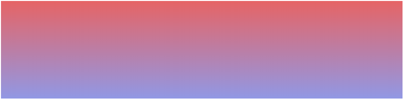

* 线性渐变--从左到右
	```css
	#grad {
	  height: 200px;
	  background-image: linear-gradient(to right, red , yellow);
	}
	```
	
	从左边开始的线性渐变。起点是红色，慢慢过渡到黄色
	```html
	<!DOCTYPE html>
	<html>
	<head>
	<meta charset="utf-8"> 
	<title>菜鸟教程(runoob.com)</title> 
	<style>
	#grad1 {
		height: 200px;
		background-color: red; /* 不支持线性的时候显示 */
		background-image: linear-gradient(to right, red , yellow);
	}
	</style>
	</head>
	<body>

	<h3>线性渐变 - 从左到右</h3>
	<p>从左边开始的线性渐变。起点是红色，慢慢过渡到黄色：</p>

	<div id="grad1"></div>

	<p><strong>注意：</strong> Internet Explorer 8 及之前的版本不支持渐变。</p>

	</body>
	</html>
	```
    效果
    
    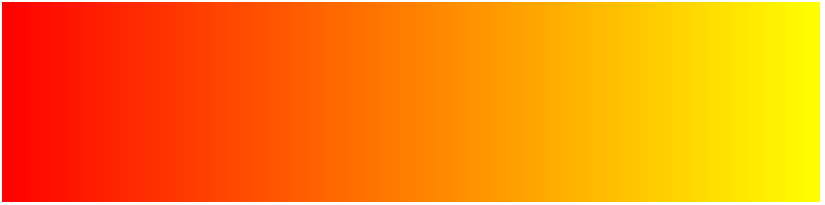

* 线性渐变--对角

	通过指定水平和垂直的起始位置来制作一个对角渐变
	```css
	#grad {
	  height: 200px;
	  background-image: linear-gradient(to bottom right, red, yellow);
	}
	```
	
	从左上角开始（到右下角）的线性渐变。起点是红色，慢慢过渡到黄色
	```html
	<!DOCTYPE html>
	<html>
	<head>
	<meta charset="utf-8"> 
	<title>菜鸟教程(runoob.com)</title> 
	<style>
	#grad1 {
		height: 200px;
		background-color: red; /* 不支持线性的时候显示 */
		background-image: linear-gradient(to bottom right, red , yellow);
	}
	</style>
	</head>
	<body>

	<h3>线性渐变 - 对角</h3>
	<p>从左上角开始（到右下角）的线性渐变。起点是红色，慢慢过渡到黄色：</p>

	<div id="grad1"></div>

	<p><strong>注意：</strong> Internet Explorer 8 及之前的版本不支持渐变。</p>

	</body>
	</html>
	```
    效果
    
    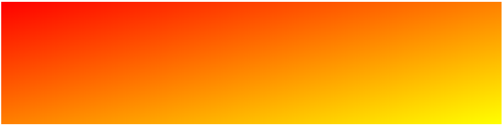

### 角度渐变
想要在渐变的方向上做更多的控制，你可以定义一个角度，而不用预定义方向（to bottom、to top、to right、to left、to bottom right，等等）。

* 语法
	```css
	background-image: linear-gradient(angle, color-stop1, color-stop2);
	```
	角度是指水平线和渐变线之间的角度，逆时针方向计算。换句话说，0deg 将创建一个从下到上的渐变，90deg 将创建一个从左到右的渐变。
	
  
  
	但是，请注意很多浏览器（Chrome、Safari、firefox等）的使用了旧的标准，即 0deg 将创建一个从左到右的渐变，90deg 将创建一个从下到上的渐变。换算公式 90 - x = y 其中 x 为标准角度，y为非标准角度。

* 带有指定的角度的线性渐变
	
	```css
	#grad {
	  background-image: linear-gradient(-90deg, red, yellow);
	}
	```
	
	```html
	<!DOCTYPE html>
	<html>
	<head>
	<meta charset="utf-8"> 
	<title>菜鸟教程(runoob.com)</title> 
	<style>
	#grad1 {
	  height: 100px;
	  background-color: red; /* 浏览器不支持的时候显示 */
	  background-image: linear-gradient(0deg, red, yellow); 
	}

	#grad2 {
	  height: 100px;
	  background-color: red; /* 浏览器不支持的时候显示 */
	  background-image: linear-gradient(5deg, red, yellow); 
	}

	#grad3 {
	  height: 100px;
	  background-color: red; /* 浏览器不支持的时候显示 */
	  background-image: linear-gradient(180deg, red, yellow); 
	}

	#grad4 {
	  height: 100px;
	  background-color: red; /* 浏览器不支持的时候显示 */
	  background-image: linear-gradient(-90deg, red, yellow); 
	}
	</style>
	</head>
	<body>

	<h3>线性渐变 - 使用不同的角度</h3>

	<div id="grad1" style="text-align:center;">0deg</div><br>
	<div id="grad2" style="text-align:center;">5deg</div><br>
	<div id="grad3" style="text-align:center;">180deg</div><br>
	<div id="grad4" style="text-align:center;">-90deg</div>

	<p><strong>注意：</strong> Internet Explorer 9 及之前的版本不支持渐变。</p>

	</body>
	</html>
	```
	
	效果
	
	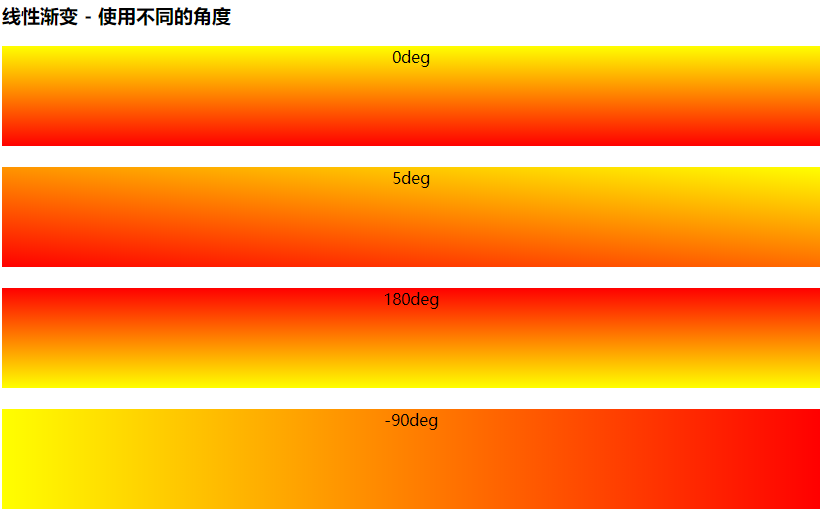

### 使用多个颜色节点
* 带有多个颜色节点的从上到下的线性渐变
    ```css
    #grad {
      background-image: linear-gradient(red, yellow, green);
    }
    ```
    
    ```html
    <!DOCTYPE html>
    <html>
    <head>
    <meta charset="utf-8"> 
    <title>菜鸟教程(runoob.com)</title> 
    <style>
    #grad1 {
        height: 200px;
        background-color: red; /* 浏览器不支持的时候显示 */
        background-image: linear-gradient(red, green, blue); /* 标准的语法（必须放在最后） */
    }

    #grad2 {
        height: 200px;
        background-color: red; /* 浏览器不支持的时候显示 */
        background-image: linear-gradient(red, orange, yellow, green, blue, indigo, violet); /* 标准的语法（必须放在最后） */
    }

    #grad3 {
        height: 200px;
        background-color: red; /* 浏览器不支持的时候显示 */
        background-image: linear-gradient(red 10%, green 85%, blue 90%); /* 标准的语法（必须放在最后） */
    }
    </style>
    </head>
    <body>

    <h3>3 个颜色结点（均匀分布）</h3>
    <div id="grad1"></div>

    <h3>7 个颜色结点（均匀分布）</h3>
    <div id="grad2"></div>

    <h3>3 个颜色结点（不均匀分布）</h3>
    <div id="grad3"></div>

    <p><strong>注意：</strong> 当指定百分比时，颜色是不均匀分布。</p>
    <p><strong>注意：</strong> Internet Explorer 8 及之前的版本不支持渐变。</p>

    </body>
    </html>
    ```
    效果
	
	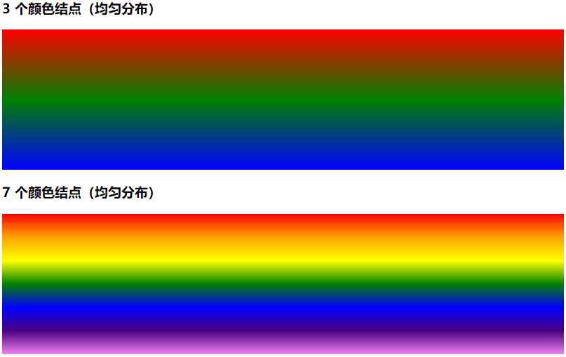  
	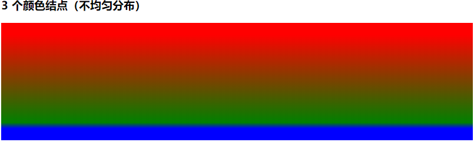  
    
    
* 一个带有彩虹颜色和文本的线性渐变
    ```css
    #grad {
      /* 标准的语法 */
      background-image: linear-gradient(to right, red,orange,yellow,green,blue,indigo,violet);
    }
    ```
    
    ```html
    <!DOCTYPE html>
    <html>
    <head>
    <meta charset="utf-8"> 
    <title>菜鸟教程(runoob.com)</title> 
    <style>
    #grad1 {
        height: 55px;
        background-color: red; /* 浏览器不支持的时候显示 */
        background-image: linear-gradient(to right, red, orange, yellow, green, blue, indigo, violet); /* 标准的语法（必须放在最后） */
    }
    </style>
    </head>
    <body>

    <div id="grad1" style="text-align:center;margin:auto;color:#888888;font-size:40px;font-weight:bold">
    渐变背景
    </div>

    <p><strong>注意：</strong> Internet Explorer 8 及之前的版本不支持渐变。</p>

    </body>
    </html>
    ```
    效果
	
	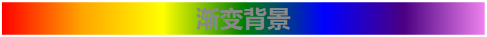  

### 使用透明度（transparent）
CSS3 渐变也支持透明度（transparent），可用于创建减弱变淡的效果。

为了添加透明度，我们使用 rgba() 函数来定义颜色节点。
rgba() 函数中的最后一个参数可以是从 0 到 1 的值，它定义了颜色的透明度：0 表示完全透明，1 表示完全不透明。

* 从左到右的线性渐变，带有透明度
    ```css
    #grad {
      background-image: linear-gradient(to right, rgba(255,0,0,0), rgba(255,0,0,1));
    }
    ```

    ```html
    <!DOCTYPE html>
    <html>
    <head>
    <meta charset="utf-8"> 
    <title>菜鸟教程(runoob.com)</title> 
    <style>
    #grad1 {
        height: 200px;
        background-image: linear-gradient(to right, rgba(255,0,0,0), rgba(255,0,0,1));
    }
    </style>
    </head>
    <body>

    <h3>线性渐变 - 透明度</h3>
    <p>为了添加透明度，我们使用 rgba() 函数来定义颜色结点。rgba() 函数中的最后一个参数可以是从 0 到 1 的值，它定义了颜色的透明度：0 表示完全透明，1 表示完全不透明。</p>

    <div id="grad1"></div>

    <p><strong>注意：</strong> Internet Explorer 8 及之前的版本不支持渐变。</p>

    </body>
    </html>
    ```
    效果
	
	  

### 重复的线性渐变
```css
#grad {
  /* 标准的语法 */
  background-image: repeating-linear-gradient(red, yellow 10%, green 20%);
}
```

```html
<!DOCTYPE html>
<html>
<head>
<meta charset="utf-8"> 
<title>菜鸟教程(runoob.com)</title> 
<style>
#grad1 {
  height: 200px;
  background-color: red; /* 浏览器不支持的时候显示 */
  background-image: repeating-linear-gradient(red, yellow 10%, green 20%); 
}

#grad2 {
  height: 200px;
  background-color: red; /* 浏览器不支持的时候显示 */
  background-image: repeating-linear-gradient(45deg,red,yellow 7%,green 10%); 
}

#grad3 {
  height: 200px;
  background-color: red; /* 浏览器不支持的时候显示 */
  background-image: repeating-linear-gradient(190deg,red,yellow 7%,green 10%); 
}

#grad4 {
  height: 200px;
  background-color: red; /* 浏览器不支持的时候显示 */
  background-image: repeating-linear-gradient(90deg,red,yellow 7%,green 10%); 
}
</style>
</head>
<body>

<h1>重复的线性渐变</h1>

<div id="grad1"></div>

<p>45deg:</p>
<div id="grad2"></div>

<p>190deg:</p>
<div id="grad3"></div>

<p>90deg:</p>
<div id="grad4"></div>

<p><strong>注意:</strong> Internet Explorer 9 及更早版本的 IE 浏览器不支持线性渐变。</p>

</body>
</html>
```
效果
	
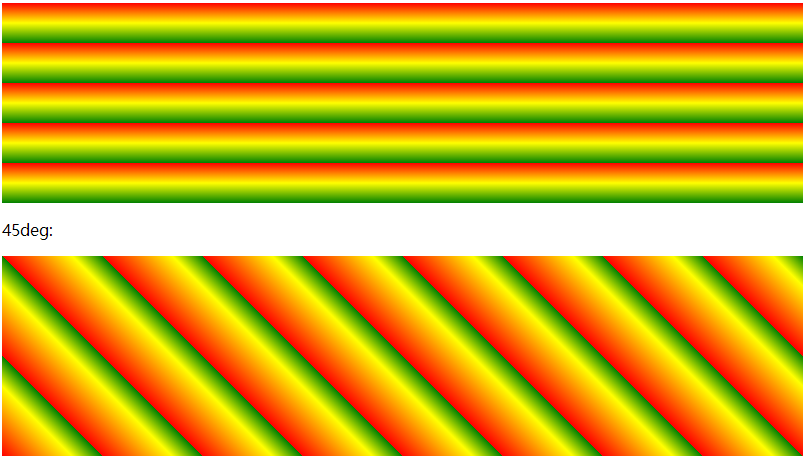  
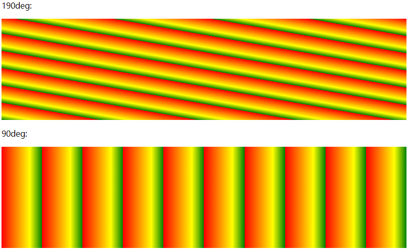  

## 径向渐变
径向渐变由它的中心定义。

为了创建一个径向渐变，你也必须至少定义两种颜色节点。颜色节点即你想要呈现平稳过渡的颜色。

同时，你也可以指定渐变的中心、形状（圆形或椭圆形）、大小。

默认情况下，渐变的中心是 center（表示在中心点），渐变的形状是 ellipse（表示椭圆形），

渐变的大小是 farthest-corner（表示到最远的角落）。

* 语法
    ```css
    background-image: radial-gradient(shape size at position, start-color, ..., last-color);
    ```

* 径向渐变--颜色节点均匀分布（默认情况下）
    ```css
    #grad {
      background-image: radial-gradient(red, yellow, green);
    }
    ```

    ```html
    <!DOCTYPE html>
    <html>
    <head>
    <meta charset="utf-8"> 
    <title>菜鸟教程(runoob.com)</title> 
    <style>
    #grad1 {
        height: 150px;
        width: 200px;
        background-color: red; /* 浏览器不支持的时候显示 */
        background-image: radial-gradient(red, green, blue); /* 标准的语法（必须放在最后） */
    }
    </style>
    </head>
    <body>

    <h3>径向渐变 - 颜色结点均匀分布</h3>
    <div id="grad1"></div>

    <p><strong>注意：</strong> Internet Explorer 9 及之前的版本不支持渐变。</p>

    </body>
    </html>
    ```
    效果
	
    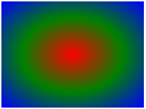  

* 径向渐变--颜色节点不均匀分布
    ```css
    #grad {
      background-image: radial-gradient(red 5%, yellow 15%, green 60%);
    }
    ```

    ```html
    <!DOCTYPE html>
    <html>
    <head>
    <meta charset="utf-8"> 
    <title>菜鸟教程(runoob.com)</title> 
    <style>
    #grad1 {
        height: 150px;
        width: 200px;
        background-color: red; /* 浏览器不支持的时候显示 */
        background-image: radial-gradient(red 5%, green 15%, blue 60%); /* 标准的语法（必须放在最后） */
    }
    </style>
    </head>
    <body>

    <h3>径向渐变 - 颜色结点不均匀分布</h3>
    <div id="grad1"></div>

    <p><strong>注意：</strong> Internet Explorer 9 及之前的版本不支持渐变。</p>

    </body>
    </html>
    ```
    效果
	
    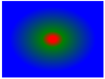
    
### 设置形状
shape 参数定义了形状。它可以是值 circle 或 ellipse。

其中，circle 表示圆形，ellipse 表示椭圆形。默认值是 ellipse。

* 形状为圆形的径向渐变
    ```css
    #grad {
      background-image: radial-gradient(circle, red, yellow, green);
    }
    ```

    ```html
    <!DOCTYPE html>
    <html>
    <head>
    <meta charset="utf-8"> 
    <title>菜鸟教程(runoob.com)</title> 
    <style>
    #grad1 {
        height: 150px;
        width: 200px;
        background-color: red; /* 浏览器不支持的时候显示 */
        background-image: radial-gradient(red, yellow, green); /* 标准的语法（必须放在最后） */
    }

    #grad2 {
        height: 150px;
        width: 200px;
        background-color: red; /* 浏览器不支持的时候显示 */
        background-image: radial-gradient(circle, red, yellow, green); /* 标准的语法（必须放在最后） */
    }
    </style>
    </head>
    <body>

    <h3>径向渐变 - 形状</h3>

    <p><strong>椭圆形 Ellipse（默认）：</strong></p>
    <div id="grad1"></div>

    <p><strong>圆形 Circle：</strong></p>
    <div id="grad2"></div>

    <p><strong>注意：</strong> Internet Explorer 9 及之前的版本不支持渐变。</p>

    </body>
    </html>
    ```
    效果
	
    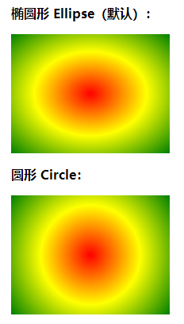

### 不同尺寸大小关键字的使用
size 参数定义了渐变的大小。它可以是以下四个值：
```
closest-side
farthest-side
closest-corner
farthest-corner
```

* 带有不同尺寸大小关键字的径向渐变
    ```css
    #grad1 {
      background-image: radial-gradient(closest-side at 60% 55%, red, yellow, black);
    }
     
    #grad2 {
      background-image: radial-gradient(farthest-side at 60% 55%, red, yellow, black);
    }
    ```

    ```html
    <!DOCTYPE html>
    <html>
    <head>
    <meta charset="utf-8"> 
    <title>菜鸟教程(runoob.com)</title> 
    <style>
    #grad1 {
      height: 150px;
      width: 150px;
      background-color: red; /* 浏览器不支持的时候显示 */
      background-image: radial-gradient(closest-side at 60% 55%, red, yellow, black); 
    }

    #grad2 {
      height: 150px;
      width: 150px;
      background-color: red; /* 浏览器不支持的时候显示 */
      background-image: radial-gradient(farthest-side at 60% 55%, red, yellow, black); 
    }

    #grad3 {
      height: 150px;
      width: 150px;
      background-color: red; /* 浏览器不支持的时候显示 */
      background-image: radial-gradient(closest-corner at 60% 55%, red, yellow, black);
    }

    #grad4 {
      height: 150px;
      width: 150px;
      background-color: red; /* 浏览器不支持的时候显示 */
      background-image: radial-gradient(farthest-corner at 60% 55%, red, yellow, black); 
    }
    </style>
    </head>
    <body>

    <h3>径向渐变 - 不同尺寸大小关键字的使用</h3>

    <p><strong>closest-side：</strong></p>
    <div id="grad1"></div>

    <p><strong>farthest-side：</strong></p>
    <div id="grad2"></div>

    <p><strong>closest-corner：</strong></p>
    <div id="grad3"></div>

    <p><strong>farthest-corner（默认）：</strong></p>
    <div id="grad4"></div>

    <p><strong>注意：</strong> Internet Explorer 9 及之前的版本不支持渐变。</p>

    </body>
    </html>
    ```
    
    效果
    
    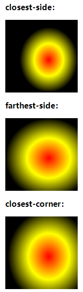
    
    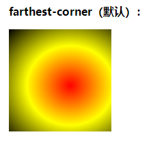

### 重复的径向渐变
repeating-radial-gradient() 函数用于重复径向渐变

* 一个重复的径向渐变
    ```css
    #grad {
      background-image: repeating-radial-gradient(red, yellow 10%, green 15%);
    }
    ```

    ```html
    <!DOCTYPE html>
    <html>
    <head>
    <meta charset="utf-8"> 
    <title>菜鸟教程(runoob.com)</title> 
    <style>
    #grad1 {
      height: 200px;
      background-image: repeating-radial-gradient(red, yellow 10%, green 15%);
    }
    </style>
    </head>
    <body>

    <h3>重复的径向渐变</h3>

    <div id="grad1"></div>

    <p><strong>注意：</strong> Internet Explorer 9 及之前的版本不支持渐变。</p>

    </body>
    </html>
    ```
    
    效果
    
    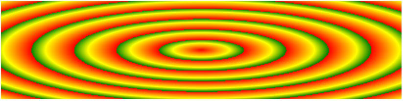