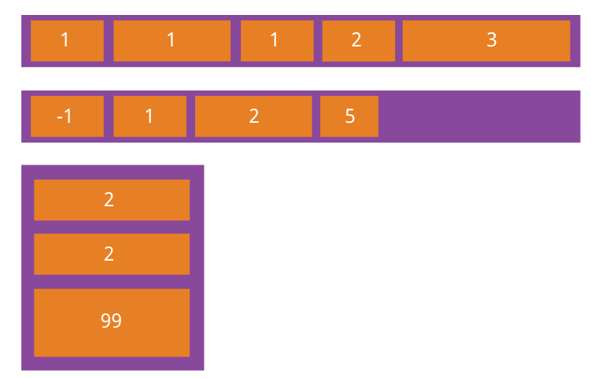
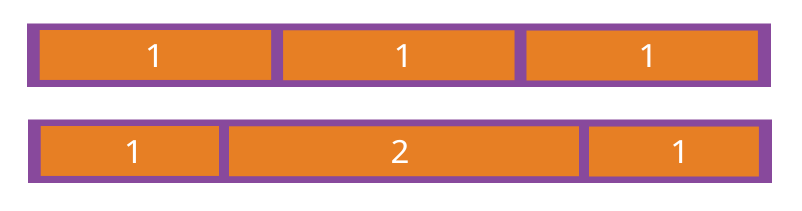

flex弹性布局
==

[参考](https://www.cnblogs.com/hellocd/p/10443237.html)

## 什么是flex弹性布局

Flexbox 是 flexible box 的简称，"灵活的盒子容器"，是 CSS3 引入的新的布局模式。

**它能够扩展和收缩 flex 容器内的元素，以最大限度地填充可用空间**


**特点**
-   在不同方向排列元素
-   重新排列元素的显示顺序
-   更改元素的对齐方式
-   动态地将元素装入容器

### 怎么开启flex布局
* **注意: 设为flex布局以后，子元素的float、clear和vertical-align属性将失效**

* 任何一个容器都可以指定为 Flex 布局。  
    ```css
    .box {
        display: flex;
    }
    ```

* 行内元素也可以使用 Flex 布局。
    ```css
    .box{
        display: inline-flex;
    }
    ```

* Webkit 内核的浏览器，必须加上-webkit前缀
    ```css
    .box{
        display: -webkit-flex; /* Safari */
        display: flex;
    }
    ```

## 一、基本概念
采用 flex 布局的元素，称为 flex 容器（flex container），简称"容器"。

它的所有子元素自动成为容器成员，

称为 Flex 项目（flex item），简称"项目"。


容器默认存在两根轴：水平的主轴（`main axis`）和垂直的交叉轴（`cross axis`）。

主轴的开始位置（与边框的交叉点）叫做 `main start`，结束位置叫做`main end`；  
交叉轴的开始位置叫做`cross start`，结束位置叫做`cross end`。

项目默认沿主轴排列。单个项目占据的主轴空间叫做`main size`，占据的交叉轴空间叫做`cross size`

在 Flexbox 模型中，有三个核心概念：
- flex 项（注：也称 flex 子元素），需要布局的元素
- flex 容器，其包含 flex 项
- 排列方向（direction），这决定了 flex 项的布局方向


## 二、容器属性
* 容器属性
    * flex-direction
    * flex-wrap
    * flex-flow
    * justify-content
    * align-items
    * align-content

    

### 2.1 flex-direction
- row（默认值）
    >主轴为水平方向，起点在左端
- row-reverse
    >主轴为水平方向，起点在右端
- column
    >主轴为垂直方向，起点在上沿
- column-reverse
    >主轴为垂直方向，起点在下沿


### 2.2 flex-wrap

- nowrap（默认）
    >不换行
- wrap
    >换行，第一行在上方
- wrap-reverse
    >换行，第一行在下方

### 2.3 justify-content
- flex-start（默认值）
    >左对齐
- flex-end
    >右对齐
- center
    >居中
- space-between
    >两端对齐，项目之间的间隔都相等。
- space-around
    >每个项目两侧的间隔相等。所以，项目之间的间隔比项目与边框的间隔大一倍。


### 2.4 align-items
- flex-start
    >交叉轴的起点对齐。
- flex-end
    >交叉轴的终点对齐。
- center
    >交叉轴的中点对齐。
- baseline
    >项目的第一行文字的基线对齐。
- stretch（默认值）
    >如果项目未设置高度或设为auto，将占满整个容器的高度。


### 2.5 align-content
定义了多根轴线的对齐方式，如果项目只有一根轴线，那么该属性将不起作用

- flex-start
    >与交叉轴的起点对齐。
- flex-end
    >与交叉轴的终点对齐。
- center
    >与交叉轴的中点对齐。
- space-between
    >与交叉轴两端对齐，轴线之间的间隔平均分布。
- space-around
    >每根轴线两侧的间隔都相等。所以，轴线之间的间隔比轴线与边框的间隔大一倍。
- stretch（默认值）
    >轴线占满整个交叉轴。


### flex-direction、justify-content、align-items结合
结合`justify-content`和`align-items`，看看在`flex-direction`两个不同属性值的作用下，轴心有什么不同


##  三、项目属性
* 项目属性
    * order
    * flex-grow
    * flex-shrink
    * flex-basis
    * flex
    * align-self

    

### 3.1 order属性
order属性定义项目的排列顺序。数值越小，排列越靠前，默认为0。

```css
.item {
    order: <integer>;
}
```

 

### 3.2 flex-grow属性
`flex-grow`属性定义项目的放大比例，默认为`0`，即如果存在剩余空间，也不放大。

如果所有项目的`flex-grow`属性都为1，则它们将等分剩余空间（如果有的话）。如果一个项目的`flex-grow`属性为2，其他项目都为1，则前者占据的剩余空间将比其他项多一倍。

```css
.item {
    flex-grow: <number>; /* default 0 */
}
```



### 3.3 flex-shrink属性
`flex-shrink`属性定义了项目的缩小比例，默认为1，即如果空间不足，该项目将缩小。

```css
.item {
    flex-shrink: <number>; /* default 1 */
}
```


如果所有项目的`flex-shrink`属性都为1，当空间不足时，都将等比例缩小。如果一个项目的`flex-shrink`属性为0，其他项目都为1，则空间不足时，前者不缩小。

负值对该属性无效。

### 3.4 align-self属性
`align-self`属性允许单个项目有与其他项目不一样的对齐方式，可覆盖`align-items`属性。默认值为`auto`，表示继承父元素的`align-items`属性，如果没有父元素，则等同于`stretch`。

```css
.item {
  align-self: auto | flex-start | flex-end | center | baseline | stretch;
}
```


**弹性布局默认不改变项目的宽度，但是它默认改变项目的高度。  
如果项目没有显式指定高度，就将占据容器的所有高度。**