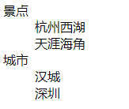
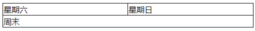
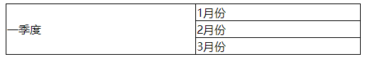
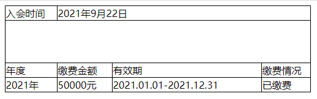
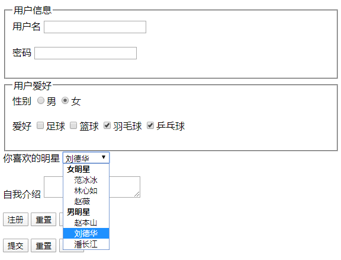

html
==


## html概述
```text
HTML:Hyper Text Markup Language 超文本标记语言

负责页面中的结构，定义出页面中的各个组成部分
HTML是采用纯文本的形式的编写，采用HTML标签来标识出页面中的不同部分
```

## 注释
块注释
```html
<!-- 注释内容 -->
```

## 网页结构
* 三个组成部分
```text
    * 结构
        结构是页面的整体结构，哪里是标题，哪里是段落，哪里是图片
        结构使用HTML来编写
    * 表现
        表现是页面的外在的样式，比如字体，字体大小，字体颜色，背景... ... 
        使用CSS来设置页面中元素的样式
    * 行为


一个设计优良的网页要求结构、表现、行为三者分离
在开发中总是要面临一个问题，就是程序之间的耦合，三者分离就是为了解耦合
```

```html
<!DOCTYPE html>
<html>
<head>
    <meta charset="UTF-8">
    <title>Title</title>
</head>
<body>
    <!-- 网页主体 -->
</body>
</html>
```

## 标签分类
* 成对标签
    ><标签名></标签名>
* 自结束标签
```text
<标签名/>
后面的/也可以省略


<input>
<link>
<br>
<hr>
```

## 属性
标签中的设置的键值对，多个属性之间使用空格分隔
```text
<标签名 属性名="属性值" 属性名="属性值"></标签名>

<标签名 属性名="属性值" 属性名="属性值" />
```

* 文档声明
    ```html
    <!doctype html>
    标识当前页面的html的版本，以上的是html 5版本
    ```
    
## 常用标签
```text
<html>  网页根元素，一个网页文件只能有一个
<head>
<body>
<h1> - <h6>
<p>
<br />
<hr />
```

* 内联框架iframe  
    使用内联框架可以引入一个外部的页面  
    内联框架中的内容不会被搜索引擎所检索，所以开发中尽量不要使用内联框架
    
    ```html
    <iframe src=""></iframe>
    ```
    * 属性
        * src
        * width
        * height
        * name
            ```text
            可以为内联框架指定一个名字
            可以将该属性值设置为超链接的target属性的值
            这样当点击超链接时，页面将会在相应的内联框架中打开
            ```
              
    **[使用iframe代理一个网站](../source_08/day08/iframe%E5%85%A8%E5%B1%8F.html)**  

* frameset框架集
    ```text
    框架集和内联框架的作用类似，都是用于在一个页面中引入其他的外部的页面，
    框架集可以同时引入多个页面，而内联框架只能引入一个，
    在h5标准中，推荐使用框架集，而不使用内联框架
    frameset和iframe一样，它里边的内容都不会被搜索引擎所检索，
    
    属性：
        rows，指定框架集中的所有的框架，一行一行的排列
        cols， 指定框架集中的所有的页面，一列一列的排列
        这两个属性frameset必须选择一个，并且需要在属性中指定每一部分所占的大小
    frameset中也可以再嵌套frameset
    ```
    [frameset框架集示例](../source_08/day08/07.框架集.html)  
            
* 超链接
    ```
    <a href="">连接的文本</a>
    ```
    * 属性
    * href
        ```text
        指向链接跳转的目标地址
        还可以是#id属性值，这样当点击超链接以后，将会跳转到当前页面的指定位置
        可以使用mailto:来创建一个发送电子邮件的超链接
        ```
    * target
        * _self  默认值，当前窗口打开链接
        * _blank  新窗口打开链接
        * 内联框架的name属性值  在指定的内联框架中打开链接
[meta标签示例](../source_02/demo/01_meta.html)
        
## 文本标签
```html
<em></em>  表示语气上的强调，斜体显示

<strong></strong>  表示强调的内容，表示内容的重要性，加粗显示

<i></i>  斜体

<b></b>  加粗

<u></u>  下划线

<del></del>  删除线，表示要删除的内容

<small></small>  表示细则一类的内容

<cite></cite>  表示参考的内容，凡是用书名号的都可以用cite

<q></q>  短引用，行内引用

<blockquote></blockquote>  长引用，块级引用

<sup></sup>  上标

<sub></sub>  下标

<ins></ins>  插入的内容

<pre></pre>  预格式，可以保留代码中空格、换行等这些格式

<code></code>  表示程序代码

```

## 列表标签
* ul无序列表
    ```html
    使用ul来创建一个无序列表，在列表中使用li来表示一个列表项
    无序列表使用符号作为项目符号
    通过type属性可以修改无序列表的项目符号
        可选值：
            disc  默认值，实心的圆点
            square  实心的方块
            circle  空心的圆
    
    示例：
    <ul>
        <li></li>
        <li></li>
        <li></li>
    </ul>
    ```
* ol有序列表
    ```html
    使用ol来创建一个无序列表，在列表中使用li来表示一个列表项
    使用有序的序号作为项目符号
    type属性，可以指定序号的类型
        可选值：
            1  默认值，使用阿拉伯数字
            a/A  小写或大写字母作为序号
            i/I  小写或大写的罗马数字作为序号
    示例：
    <ol>
        <li></li>
        <li></li>
        <li></li>
    </ol>
    ```
* dl自定义列表
    ```html
    dl中有两个子标签
        dt  被定义的内容
        dd  对定义内容的描述
    示例：
    <dl>
        <dt>景点</dt>
            <dd>杭州西湖</dd>
            <dd>天涯海角</dd>
        <dt>城市</dt>
            <dd>汉城</dd>
            <dd>深圳</dd>
    </dl>
    ```
    效果图:  
      
    
* 列表相关的元素都是块元素，他们之间可以互相嵌套
* 去除项目符号
  >list-style: none;

## 图片标签
```html


属性：
    src  图片路径或URL
    alt  在图片无法加载时对图片的描述，搜索引擎主要通过该属性来识别图片的内容，不写该属性则搜索引擎会对图片进行收录
    width
    height
```

## table表标签
table是块元素

* 子标签
```html
<tr></tr>  一行，可写多行
<td></td>  一列，一个单元格
<th></th>  表头中的一列，它的用法和td一样，不同的是它会有一些默认效果（加粗）

<thead></thead>  表头，有默认样式，永远会显示在表格的头部
<tbody></tbody>  表体，永远都会显示表格的中间
<tfoot></tfoot>  表底部，永远都会显示表格的底部
以上三个标签都可以省略不写

如果表格中没有写tbody，浏览器会自动在表格中添加tbody
并且将所有的tr都放到tbody中，所以注意tr并不是table的子元素，而是tbody的子元素
通过table > tr 无法选中行 需要通过tbody > tr


```
* 属性
    ```text
    border  边框
    border-spacing  table和td边框之间默认有一个距离
    border-collapse: collapse;  设置表格的边框合并，border宽度为0，如果设置了边框合并，则border-spacing自动失效
    border-spacing: 长度;  相邻单元格的边框间的距离，仅border-collapse: separate; "边框分离"模式时生效
    rowspan="n"  由此单元格纵向向下合并n个单元格，写在 <td>、<th>标签中
    colspan="n"  由此单元格横向向右合并n个单元格，写在 <td>、<th>标签中
    ```
    示例：
    ```css
    div table {
        width: 300px;
        margin: 0 auto;
        border-collapse: collapse; /* 合并表格边距 */
    }
    
    td, th {
        border: 1px solid black;
    }
    ```

```html
<table>
    <thead>
        <tr>
            <th>日期</th>
            <th>收入</th>
            <th>支出</th>
            <th>合计</th>
        </tr>    
    </thead>
    
    <tfoot>
        <tr>
            <td></td>
            <td></td>
            <td>合计</td>
            <td>100</td>
        </tr>
    </tfoot>  
      
    <tbody>
        <tr>
            <td>10.24</td>
            <td>500</td>
            <td>300</td>
            <td>200</td>
        </tr>
        <tr>
            <td>10.25</td>
            <td>600</td>
            <td>200</td>
            <td>400</td>
        </tr>
    </tbody>
</table>
```

### 合并单元格
*  单元格跨行
    ```html
    <table>
        <tr>
            <td>星期六</td>
            <td>星期日</td>
        </tr>
        
        <tr>
            <td colspan="2">周末</td>
        </tr>
    </table>
    ```
    效果
    

* 单元格跨列
    ```html
    <table>
        <tr>
            <td rowspan="3">一季度</td>
            <td>1月份</td>
        </tr>
        
        <tr>
            <td>2月份</td>
        </tr>
        <tr>
            <td>3月份</td>
        </tr>
    </table>
    ```
    
    效果
    

### 第一行colspan合并单元格后，设置td宽度失效的解决方法
为防止td被连串字符撑开，表格一般会定义一个table-layout: fixed;

如果首行有合并单元格的话 td定义宽度就会失效。

解决方法：<colgroup>定义列宽度

* 示例
    ```html
    <html>
    <head>
    <style>
    table {
        width: 500px;
        margin: 0 auto;
        border-collapse: collapse; /* 合并表格边距 */
    }
    
    td, th {
        border: 1px solid black;
    }
    </style>
    </head>
    
    <body>
        <table>
            <colgroup>
                <col style="width: 85px">
                <col style="width: 90px">
                <col style="width: auto">
                <col style="width: 80px">
            </colgroup>
            
            <tr>
                <td>入会时间</td>
                <td colspan="3">2021年9月22日</td>
            </tr>
            <tr>
                <td colspan="4" style="height: 70px;"></td>
            </tr>
            <tr>
                <td>年度</td>
                <td>缴费金额</td>
                <td>有效期</td>
                <td>缴费情况</td>
            </tr>
            <tr>
                <td>2021年</td>
                <td>50000元</td>
                <td>2021.01.01-2021.12.31</td>
                <td>已缴费</td>
            </tr>
        </table>
    </body>
    </html>
    ```
    效果  
    

## form表单
form>标签用于为用户输入创建 HTML 表单

```html
<form action="发送表单数据的URL" method="get" enctype="multipart/form-data">

</form>
```
* fieldset表单项分组
    ```text
    可以将表单项中的同一类放到一个fieldset中，组成一组
    在fieldset标签内，使用legend子标签，来指定组名
    ```
    [表单示例](../source_08/day08/06.表单.html)  
      

* 属性
    * action
        >当提交表单时，向何处发送表单数据
    * method
        ```text
        发送 form-data 的 HTTP 方法:
            get
            post
        ```
    * enctype
        ```text
        表单数据数据编码方式
        可选值：
            application/x-www-form-urlencoded
            multipart/form-data  可发送文件
            text/plain
        ```
    * target
        ```text
        在何处打开 action URL
        可选值：
            _self  默认值
            _blank  新窗口
            _parent  父窗口
            _top
            framename
        ```
## input与textarea标签
```text
input、textarea标签用于搜集用户信息
```
```html
<input type="类型" name="field_name" value="值" checked="checked">
```

* **label包裹input点击文字可选中输入框或按钮**  
    ```html
    <!-- 点击 用户，光标就会聚焦到输入框中 -->
    <label>用户<input>
    </label>
    ```
    也可以给<input>标签定义一个id，label用for="id值" 关联起来  
    ```html
    <label for="pwd">密码</label>
    <input id="pwd" type="password" name="password" />
    ```

* 属性
    * type
    * name
    * value
        >input 元素的值
    * checked
        >input 元素首次加载时应当被选中，值checked，js中则为true/false
    * readonly
        >规定输入字段为只读
    * required
        >指示输入字段的值是必需的
    * size
        >定义输入字段的宽度
    * type
    ```text
    元素类型
    
    可选值：
        text  单行文本域
        radio  单选按钮，通过name属性进行分组，name属性相同是一组按钮
        checkbox  复选框，通过name属性进行分组，name属性相同是一组复选框
        password  密码域
        file  文件
        reset  重置按钮，value为按钮显示的文本
        submit  提交按钮，value为按钮显示的文本
        button  按钮，value为按钮显示的文本
        image
        hidden
    ```

* textarea多行文本域
    ```html
    <textarea rows="10" cols="30"></textarea>
    ```
    rows  文本框的行数，内容超过后，会出现滚动条  
    cols  每行的字数

## select下拉列表
```text
下拉列表的name属性需要指定给select，而value属性需要指定给option
```
* 子标签
    * optgroup
        >选项组，label属性指定组名
    * option
        >单个选项，可添加多个

* 属性
    * name
    * size
        >下拉列表中可见选项的数目
    * selected="selected"
        >表示首次加载时应当被选中
    * multiple="multiple"
        >设置为多选的下拉列表。缺省该属性则为 单选下拉列表

select示例
```html
<select name="star">
    <!-- 
        在select中可以使用optgroup对选项进行分组
            同一个optgroup中的选项是一组
        可以通过label属性来指定分组的名字	
    -->
    <optgroup label="女明星">
        <option value="fbb">范冰冰</option>
        <option value="lxr">林心如</option>
        <option value="zw">赵薇</option>
    </optgroup>
    
    <optgroup label="男明星">
        <option value="zbs" selected="selected">赵本山</option>
        <option value="ldh">刘德华</option>
        <option value="pcj">潘长江</option>
    </optgroup>
</select>
```

## base标签
```text
为页面上的所有链接的/根路径指定URL或默认目标，写在<head>块内，是自结束标签

在没有没有定义base标签的href是，默认相对路径的基准URL是 http://ip:port/

修改base标签的href的URL就是修改/根的路径
```
* 属性
    * href
        ```text
        规定页面中所有相对链接的基准 URL。值为URL。
        受影响包括 <a>、、<link>、<form> 标签中的 URL
        默认浏览器随后使用当前文档的 URL作为基准的URL。相当于定义/根URL
        ```
    * target
        ```text
        可选，在何处打开页面中所有的链接。
        值：
        _blank
        _parent
        _self
        _top
        framename
        ```
示例
```html
<head>
    <base href="http://127.0.0.1:8080/tomcat/">
</head>
```

[base标签](../source_05/day05/base标签.html)  

## 实体(转义字符)
```text
语法：
&实体名;
```

* 常用实体
    ```html
    空格  &nbsp;
    <  $lt;
    >  &gt;
    版权符号  &copy;
    ```

## 相对路径
相对于当前资源所在的目录的路径
```text
./  表示当前路径，可以省略
../  上一层目录，可以使用多层
```

## xHTML语法规范
* HTML中不区分大小写，但是尽量使用小写
* HTML的注释不能嵌套
* 标签必须结构完整，要么成对出现，要么是自结束标签
* 标签可以嵌套但是不能交叉嵌套
* 属性必须有值，且值必须加引号，单引号双引号都可以


## IE版本判断
对于特定版本的IE修复问题特别好用
```html
<!--[if IE]>
所有的IE
<![endif]-->

<!--[if !IE]>
除IE外
<![endif]-->

<!--[if IE 6]>
仅IE6
<![endif]-->

<!--[if lte IE 8]>
IE 8及以下版本
<![endif]-->

<!--[if lt IE 8]>
小于 IE8
<![endif]-->

<!--[if lte IE 8]>
小于等于 IE8
<![endif]-->

<!--[if gt IE 8]>
大于 IE8
<![endif]-->

<!--[if gte IE 8]>
大于等于 IE8
<![endif]-->

<!--[if (IE 8)|(IE 9)]>
IE8或IE9
<![endif]-->

```

示例：
```html
<!--[if IE 6]>
    <script type="text/javascript" src="js/DD_belatedPNG_0.0.8a-min.js"></script>
    <script type="text/javascript">DD_belatedPNG.fix("div,img,a,h1");</script>
<![endif]-->
``` 

