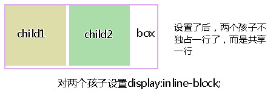
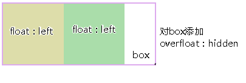
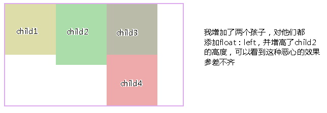
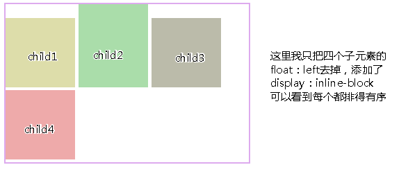

inline-block布局 vs 浮动布局
==

## 异同比较
* 不同之处
    ```text
    对元素设置display：inline-block ，元素不会脱离文本流，
    而float就会使得元素脱离文本流，且还有父元素高度坍塌的问题要处理
    ```
* 相同之处
    >能在某程度上达到一样的效果
    
## 比较布局效果
* 图1 display：inline-block
      

* 图2 对两个子元素使用float：left
      
    
乍一看两个都能做到几乎相同的效果，（仔细看看display：inline-block中有间隙问题）

## 浮动布局不太好的地方：参差不齐的现象
* 图3
  

* 图4
      
    
    ```text
    从图3,4 可以看出浮动的局限性在于，若要元素排满一行，
    换行后还要整齐排列，就要子元素的高度一致才行，
    不然就会出现图三的效果，而inline-block就不会
    ```

## inline-block存在的小问题
* 空隙问题
    ```text
    上面可以看到用了display:inline-block后，存在间隙问题，间隙为4像素，
    这个问题产生的原因是换行引起的，因为我们写标签时通常会在标签结束符后顺手打个回车，
    而回车会产生回车符，回车符相当于空白符，通常情况下，多个连续的空白符会合并成一个空白符，
    而产生“空白间隙”的真正原因就是这个让我们并不怎么注意的空白符。
    ```

* 去除空隙的方法
    ```text
    1.对父元素添加，{font-size:0}，即将字体大小设为0，那么那个空白符也变成0px，从而消除空隙
    现在这种方法已经可以兼容各种浏览器，以前chrome浏览器是不兼容的
    
    c.浏览器兼容性：ie6/7是不兼容 display：inline-block的所以要额外处理一下：
    　　在ie6/7下：
    　　对于行内元素直接使用{dislplay:inline-block;}
    　　对于块级元素：需添加{display:inline;zoom:1;}
    ```
    
    
* 总结
    ```text
    display：inline-block的布局方式和浮动的布局方式，究竟使用哪个，我觉得应该根据实际情况来决定的：
    
    a. 对于横向排列东西来说，我更倾向与使用inline-block来布局，
        因为这样清晰，也不用再像浮动那样清除浮动，害怕布局混乱等等。
    
    b.对于浮动布局就用于需要文字环绕的时候，毕竟这才是浮动真正的用武之地，
        水平排列的是就交给inline-block了。
    ```