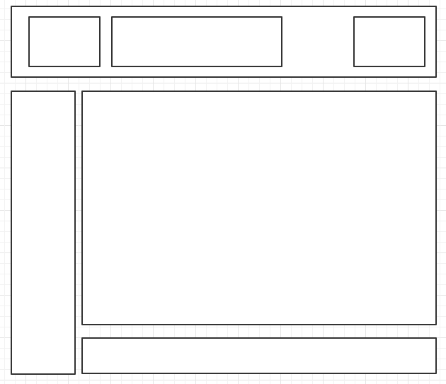
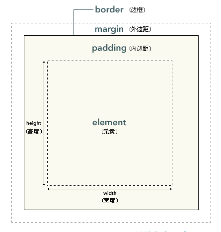

盒子模型
==

## 概述
```text
CSS中将每一个元素都设置为了一个矩形的框，方便页面的布局。
CSS框模型 (Box Model) 规定了元素框处理元素内容、内边距、边框 和 外边距 的方式
```
  

## 框的组成部分
盒子的可见框大小由内容区、内边距和边框共同决定

  


### 元素内容区
```text
在框的最里边
元素的所有的子元素都是放在父元素的内容区

属性：
    width  宽度
    height  高度
```

### 内边距padding
* 四个方向
    ```text
    padding-top
    padding-right
    padding-bottom
    padding-left
    ```
* 简写方式
    ```text
    padding
    四个方向的内边距，规则和border-width
        padding: 上 右 下 左;  /* 4个参数 */
        padding: 上 左右 下;  /* 3个参数 */
        padding:上下  左右;  /* 2个参数 */
        padding: 上右下左;  /* 1个参数 */
    ```
    
### 边框border
```text
边框盒子可见框最外侧，边框是盒子的边缘
```
* 必须设置的3个样式
    * border-width  边框线的粗细，统一指定4个方向的边框宽度，border-color、border-style使用同此
        ```text
        border-width: 上 右 下 左;  /* 4个参数 */  如 border-width: 10px 20px 30px 40px;
        border-width: 上 左右 下;  /* 3个参数 */
        border-width:上下  左右;  /* 2个参数 */
        border-width: 上右下左;  /* 1个参数 */
        ```
    * border-color
    * border-style
        ```text
        可选值：
            none  默认值
            hidden  同none
            dotted  点状线
            dashed  虚线
            solid  实线
            double  双实线
            groove  3D 凹槽边框，其效果取决于 border-color 的值
            ridge  3D 垄状边框
            inset  3D inset 边框
            outset  3D outset 边框
            inherit  从父元素继承边框样式
        ```
* 分方向设置边框样式
    * border-xxx-width
    * border-xxx-color
    * border-xxx-style
    
    **xxx可以是top、right、bottom、left**
* **边框的简写属性**
    * border
        ```text
        可以同时设置四个边的宽度、颜色、样式，
        宽度、颜色、样式值之间用空格分隔，没有顺序要求，这条规则下同
        ```
    * border-top
    * border-right
    * border-bottom
    * border-left
    
### 外边距margin
```text
外边距盒子和其他盒子之间的距离，外边距不会影响可见框的大小，
但是会影响盒子的位置
```
* 4个方向的外边距
    * margin-top
    * margin-right
    * margin-bottom
    * margin-left
* 外边距简写属性
    >margin，规则和padding一致
* margin值
    * 可以设置为auto
        ```text
        * 单独将左或右外边距设置为auto，则会将左或右外边距设置为最大值
        * 左、右外边距同时为auto，会将左右外边距设置为一个相等的值，通过这种方式使一个子元素在它的父元素中水平居中
            如 margin:0 auto;
        ```
    * 为负值，元素会向相反的方向移动
* 外边距的重叠
    * 水平相邻的两个盒子，水平外边距不会重叠，而是取和
    * 相邻的垂直外边距会发生重叠现象
        >相邻元素的外边距会取最大值
        * 子元素的外边距会传递给父元素

## 内联元素的盒子模型规则
* width、height不支持
* padding
    >垂直方向的padding会影响布局
* border
    >支持四个方向边框，但是垂直的边框不会影响布局（即垂直方向的无效果）
* margin
    >只支持水平方向外边距，垂直方向的无效果
    
## 盒模型相关的样式：display、visibility、overflow
* display
    ```text
    元素的显示类型
    
    可选值：
        none  元素不会在页面中显示，并且不会占据页面的位置
        block  元素会作为块元素显示
        inline  元素会作为内联元素显示
        inline-block  元素会作为行内块元素显示，同时具体内联元素、块元素的特点：不独占一行，可设置宽高
    ```
    * inline（行内元素）
        ```text
        * 使元素变成行内元素，拥有行内元素的特性，与其他行内元素共享一行，不会独占一行. 
        * 不能更改元素的height，width的值，大小由内容撑开. 
        * 可以使用padding上下左右都有效，margin只有left和right产生边距效果，但是top和bottom就不行.
        ```
    
    * block（块级元素）
        ```text
        * 使元素变成块级元素，独占一行，在不设置自己的宽度的情况下，块级元素会默认填满父级元素的宽度. 
        * 能够改变元素的height，width的值. 
        * 可以设置padding，margin的各个属性值，top，left，bottom，right都能够产生边距效果.
        ```
    
    * inline-block（行-块级元素）:
        ```text
        结合了inline与block的一些特点，结合了上述inline的第1个特点和block的第2,3个特点.
        用通俗的话讲，就是不独占一行的块级元素
    ```
    
* visibility
    ```text
    是否在页面中可见
    
    可选值：
        visible  默认值
        hidden  元素不在页面中显示，但是依然在页面中占据位置
    ```
* overflow
    ```text
    设置元素如何处理溢出内容
    
    可选值：
        visible  默认值，不会处理溢出的内容，在父元素以外的地方显示
        hidden  溢出的内容会被隐藏不会显示
        scroll  在父元素中同时添加水平和垂直方向的滚动条，不管内容是否溢出都会添加滚动条
        auto  根据需要自动生成滚动条
    ```

## 文档流
```text
文档流指的是网页中的一个位置

文档流是网页的基础，是网页的最底层，所有的元素默认都是在文档流中排列
元素在文档流中默认自左向右，自上向下排列（和我们的书写习惯一致）

```

* 块元素
    * 块元素在文档流中自上向下排列
    * 块元素在文档流中 宽度 默认是父元素的100%
    * 块元素在文档流中 高度 默认被内容撑开
    
* 内联元素
    * 内联元素在文档流中自左向右排列，如果一行中不足以容下所有的内联元素，则换到下一行，继续自左至右排列
    * 内联元素在文档流中 宽度和高度 默认都被内容撑开